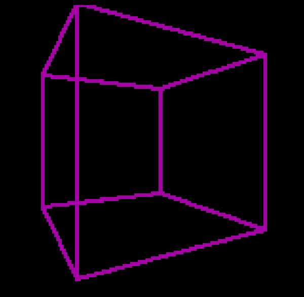
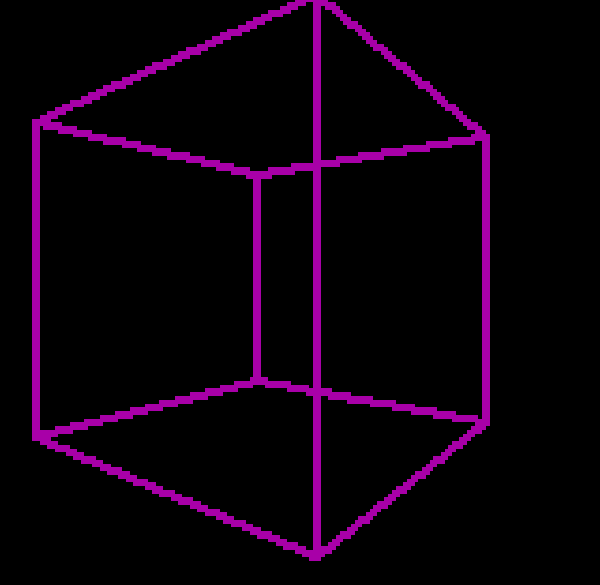
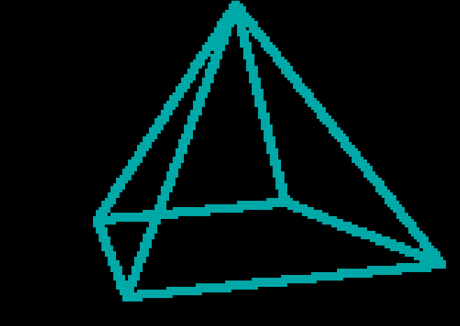
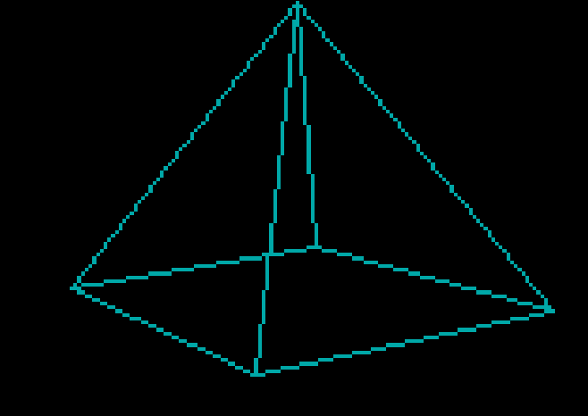

# Wireframe Renderer for the Z80


Allows you to display "any" 3D objekt on screen, you just have to figure out how to generate the verticies and faces.


## Features

- Customizable rotation speed

- Customizable distance to the camera

- Customizable Color

- Customizable Draw thickness


It's still a bit bugy, since i use a lut for cos / sin whith limits the possible angle to 255


## Compile

You'll have to understand the whole Zeal-8-Bit Projekt, but i assume u do:
```
 export ZGDK_PATH=/your/path/to/zeal-game-development-kit
 make
```

## Final
Feel free to to do whatever you wan't with the code or give tipps for improvment.
Big thanks to Zoding(https://www.youtube.com/@TsodingDaily) for the whole rendering logic.

## Images





